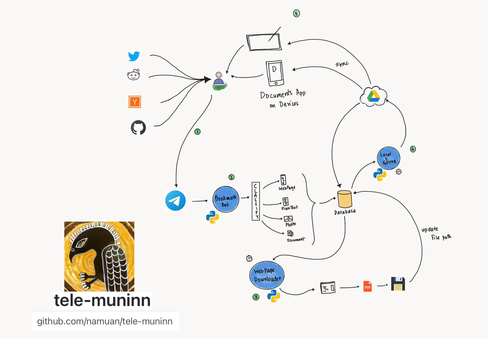

# tele-muninn

Collection of Telegram bots


> Acrylic Paint of Muninn, Aerial View, in the style of Ancient Egyptian Art



###### Setting up python3 and dependencies with VirtualEnv

```
 make setup
```

### Scripts

<!-- START makefile-doc -->
muninn-photo-ocr.py
```
Running Muninn-OCR
usage: muninn-photo-ocr.py [-h] -d DATABASE_FILE_PATH [-b] [-v]

options:
  -h, --help            show this help message and exit
  -d DATABASE_FILE_PATH, --database-file-path DATABASE_FILE_PATH
                        Path to database file
  -b, --batch           Run in batch mode (no scheduling, just run once)
  -v, --verbose         Increase verbosity of logging output. Display context
                        variables between each step run

```
tele-social-vdo.py
```
usage: tele-social-vdo.py [-h] [-i INPUT_URL] [-b] [-v]

Telegram bot to download videos from social media websites

options:
  -h, --help            show this help message and exit
  -i INPUT_URL, --input-url INPUT_URL
                        Input url
  -b, --run-as-bot      Run as telegram bot
  -v, --verbose         Increase verbosity of logging output. Display context
                        variables between each step run

```
muninn-storage.py
```
Running Muninn-Storage
usage: muninn-storage.py [-h] -d DATABASE_FILE_PATH -t TOKEN_FILE [-b] [-v]

Copy local files to GDrive remote storage

options:
  -h, --help            show this help message and exit
  -d DATABASE_FILE_PATH, --database-file-path DATABASE_FILE_PATH
                        Path to database file
  -t TOKEN_FILE, --token-file TOKEN_FILE
                        Token file for authenticated GDrive access
  -b, --batch           Run in batch mode (no scheduling, just run once)
  -v, --verbose         Increase verbosity of logging output. Display context
                        variables between each step run

```
tele_bookmark_bot.py
```
usage: tele_bookmark_bot.py [-h] [-v]

Bookmark notes, web pages, tweets, youtube videos, and photos.

options:
  -h, --help     show this help message and exit
  -v, --verbose  Increase verbosity of logging output

```
muninn-git-repo-downloader.py
```
Running Muninn-GitRepo-Downloader
usage: muninn-git-repo-downloader.py [-h] -d DATABASE_FILE_PATH [-b] [-v]

Download the snapshot of GitHub repos as a zip file and save it to local file system

options:
  -h, --help            show this help message and exit
  -d DATABASE_FILE_PATH, --database-file-path DATABASE_FILE_PATH
                        Path to database file
  -b, --batch           Run in batch mode (no scheduling, just run once)
  -v, --verbose         Increase verbosity of logging output. Display context
                        variables between each step run

```
tele_web_links.py
```
usage: tele_web_links.py [-h] [-v]

Send links to telegram on a schedule

options:
  -h, --help     show this help message and exit
  -v, --verbose  Increase verbosity of logging output

```
muninn-web-page-downloader.py
```
Running Muninn-WebPage-Downloader
usage: muninn-web-page-downloader.py [-h] -d DATABASE_FILE_PATH [-b] [-v]

Download web page using puppeteer and save it to local file system

options:
  -h, --help            show this help message and exit
  -d DATABASE_FILE_PATH, --database-file-path DATABASE_FILE_PATH
                        Path to database file
  -b, --batch           Run in batch mode (no scheduling, just run once)
  -v, --verbose         Increase verbosity of logging output. Display context
                        variables between each step run

```
twitter-fetch.py
```
usage: twitter-fetch.py [-h] -i INPUT

Download video from tweet url

options:
  -h, --help            show this help message and exit
  -i INPUT, --input INPUT
                        Twitter Url

```
tele_pathy.py
```
usage: tele_pathy.py [-h] [-v]

Receive voice messages from Telegram and convert them to text using OpenAI Whisper
Then send the text to OpenAI GPT-3 to generate a response
Then convert the response back to audio using TTS
Then send the audio back to Telegram

options:
  -h, --help     show this help message and exit
  -v, --verbose  Increase verbosity of logging output

```
hn_new_github_repos.py
```
Running HN GitHub Repos
usage: hn_new_github_repos.py [-h] [-b] [-v]

Find Links to Github/GitLab and Bitbucket from HN new news
Send links over Telegram

Usage:
./hn_new_github_repos.py -h

options:
  -h, --help     show this help message and exit
  -b, --batch    Run in batch mode (no scheduling, just run once)
  -v, --verbose  Increase verbosity of logging output. Display context
                 variables between each step run

```
tele_research_agent.py
```
usage: tele_research_agent.py [-h] [-v] -q QUESTION -f FILE

A personal research assistant

Usage:
./tele_research_agent.py -h

./tele_research_agent.py -q QUESTION -f MARKDOWN_FILE
./tele_research_agent.py -q "What is the best way to learn programming?" -f output.md

options:
  -h, --help            show this help message and exit
  -v, --verbose         Increase verbosity of logging output
  -q QUESTION, --question QUESTION
                        Question to be asked
  -f FILE, --file FILE  Target markdown file path

```
twitter_furus.py
```
usage: twitter_furus.py [-h] [-v]

Fetch tweets from a list of twitter accounts and send the tweets to a telegram group
It also generates a chart for the stock symbol mentioned in the tweet

options:
  -h, --help     show this help message and exit
  -v, --verbose  Increase verbosity of logging output

```
tele_stock_rider_bot.py
```
usage: tele_stock_rider_bot.py [-h] [-v]

Listen to messages with a stock ticker starting with a $ sign and reply with a chart.
It also sends a messages with links to various websites with more information about the stock.

options:
  -h, --help     show this help message and exit
  -v, --verbose  Increase verbosity of logging output

```
tele_openai_bot.py
```
usage: tele_openai_bot.py [-h] [-v]

Listen to messages with tt and ii prefix
If a message begins with tt then it'll send a prompt to OpenAI Completion API
If a message begins with ii then it'll send a prompt to OpenAI Image API

options:
  -h, --help     show this help message and exit
  -v, --verbose  Increase verbosity of logging output

```
twitter-threads.py
```
usage: twitter-threads.py [-h] -i TWEET_URL -o OUTPUT_DIR [-v]

Download all tweets given a Twitter thread and archive them in a single HTML file.
The input is a URL to the first tweet in the thread.
The output is a directory where everything downloaded is stored. The HTML file is named with the tweet user and tweet id.
Eg:
./twitter-threads.py -i https://twitter.com/elonmusk/status/1320000000000000000 -o output_dir

options:
  -h, --help            show this help message and exit
  -i TWEET_URL, --tweet_url TWEET_URL
                        URL to the first tweet in the thread
  -o OUTPUT_DIR, --output-dir OUTPUT_DIR
                        Output directory
  -v, --verbose         Increase verbosity of logging output. Display context
                        variables between each step run

```
<!-- END makefile-doc -->

### Development

Run `make deps` to update dependencies

Run `make pre-commit` to all the pre-commit hooks

Commit and push all the changes
